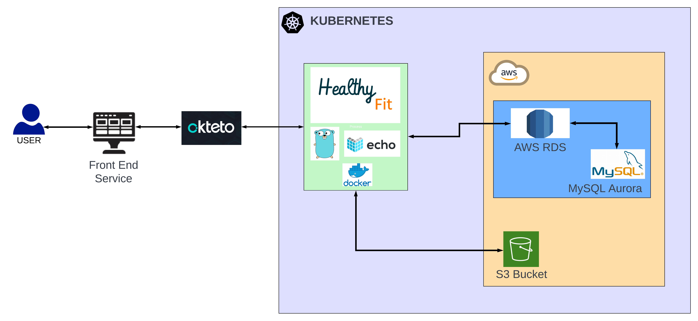
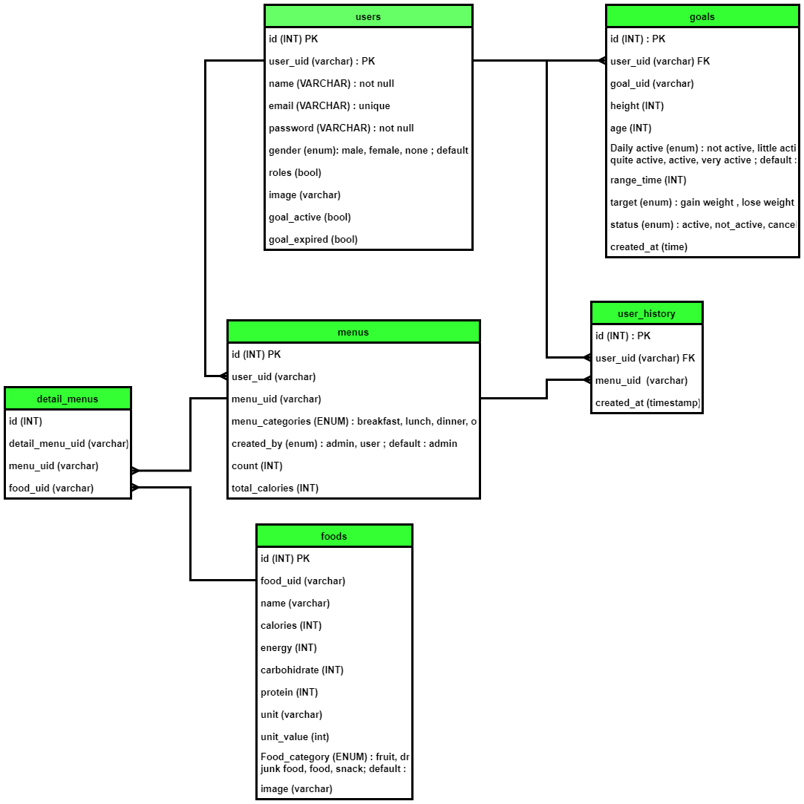

<div id="top"></div>

# Healthy Fit

<!-- PROJECT LOGO -->
<div align="center">
  <a href="https://raw.githubusercontent.com/FINAL-PROJECT-ALTA/FE/development/image/logo-white.png">
    
  </a>

  <h3 align="center">Healthy Fit</h3>
  <p align="center">
   An application that aims its users to monitor eating behavior on a daily basis
    <br />
    <div id = "other-software-design"></div>
    ·
     <a href="https://app.swaggerhub.com/apis/aaryadewangga/Final_Project/1.0#/">Open API</a>
    ·
    <a href="https://github.com/FINAL-PROJECT-ALTA/FE">Front-End</a>
    ·
    <a href="https://github.com/FINAL-PROJECT-ALTA/QE">Quality-Engineer</a>
  </p>
</div>
<br />

<!-- TABLE OF CONTENTS -->
## Table of Contents
1. [About the Project](#about-the-project)
2. [Feature](#feture)
3. [Tech Stack](#tech-stack)
4. [Hight Level Architecture](#high-level-architecture)
5. [ERD](#erd)
6. [Unit Testing](#unit-testing)
6. [How to Contribute](#contribute)
7. [Authors](#authors)

<!-- ABOUT THE PROJECT -->
## About The Project
An application to get recommendations for health-supporting foods to lose weight or gain weight


<p align="right">(<a href="#top">back to top</a>)</p>

## Feature
-  Login and Logout
-  Create account registration

As Users
-  See the content of the food or drink
-  Set a goal to get a recommendation menu calculation
-  Choose the recommend menu
-  View the history of the selected menu

As Admin
-  CRUD types of food, drinks, fruit, snacks
-  CRUD types of recommend menu


<p align="right">(<a href="#top">back to top</a>)</p>

## Tech Stack
### Framework
- [Echo (Go Web Framework)](https://echo.labstack.com/)

### Build With
- [Golang (Language)](https://go.dev/) 
- [Gorm (ORM Library)](https://aws.amazon.com/id/?nc2=h_lg)
- [Testify (Unit Test)](https://github.com/stretchr/testify)

### Third Party
- [AWS S3 Bucket](https://aws.amazon.com/id/?nc2=h_lg)
- [Edamam Food Databases](https://www.edamam.com/)

### Database
- [AWS RDS](https://aws.amazon.com/id/?nc2=h_lg)

### Deployment
- [Docker (Container - image)](https://hub.docker.com/)
- [Okteto (Kuberneter Platform)](https://www.okteto.com/)

### Collaboration 
- [Trello](https://trello.com/) - Manage Project
- [Github](https://github.com/) - Versioning Project

<p align="right">(<a href="#top">back to top</a>)</p>

<!-- Preview -->
## Contribute

- Fork this repository

    ```sh
    $ git clone https://github.com/YOUR_USERNAME/FINAL-PROJECT-ALTA/BE.git
    > Cloning into `healthy-fit`...
    > remote: Counting objects: 10, done.
    > remote: Compressing objects: 100% (8/8), done.
    > remove: Total 10 (delta 1), reused 10 (delta 1)
    > Unpacking objects: 100% (10/10), done.
    ```
<p align="right">(<a href="#top">back to top</a>)</p>


<!-- HLA -->
## High Level Architecture



<p align="right">(<a href="#top">back to top</a>)</p>

<!-- ERD -->
## ERD



<p align="right">(<a href="#top">back to top</a>)</p>

<!-- Testing -->
## Unit Testing


<p align="right">(<a href="#top">back to top</a>)</p>

<!-- CONTACT -->
## Authors
* Arya Nur Dewangga Putra - [Github](https://github.com/aaryadewangga) · [LinkedIn](https://www.linkedin.com/in/aryadewangga/)
* Ade Mawan - [Github](https://github.com/ademawan) · [LinkedIn](https://www.linkedin.com/in/ade-mawan-527657177/)

<p align="right">(<a href="#top">back to top</a>)</p>
